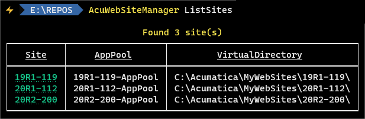

# AcuWebSiteManager
```
Providing net global tool in order to manage acumatica website creation and deletion
```

> In this repo, i m building a global tool that allows to create or delete [acumatica](https://www.acumatica.com/) websites.
>
> The tool is based on 4 sub commmands :
> - Use sub command `CreateSite` to create site
> - Use sub command `DeleteSite` to delete site
> - Use sub command `ListSites` to list iis sites
> - Use sub command `SwitchSite` to switch site to use another database
>
> To run code in debug or release mode, type the following commands in your favorite terminal : 
> - `.\App.exe ListSites`
> - `.\App.exe CreateSite -x [XmlConfigFile]`
> - `.\App.exe DeleteSite -x [XmlConfigFile]`
> - `.\App.exe SwitchSite -s [CurrentWebSite] -d [TargetDatabaseName]`
>
> To install, run, update, uninstall global tool from a local source path, type commands :
> - `dotnet tool install -g --configfile .\Nugets\local.config AcuWebSiteManager`
> - `AcuWebSiteManager -h`
> - `AcuWebSiteManager -c`
> - `AcuWebSiteManager ListSites`
> - `AcuWebSiteManager CreateSite -h`
> - `AcuWebSiteManager DeleteSite -h`
> - `AcuWebSiteManager CreateSite -x [XmlConfigFile]`
> - `AcuWebSiteManager DeleteSite -x [XmlConfigFile]`
> - `AcuWebSiteManager SwitchSite -s [CurrentWebSite] -d [TargetDatabaseName]`
> - `dotnet tool update -g AcuWebSiteManager --ignore-failed-sources`
> - `dotnet tool uninstall -g AcuWebSiteManager`
>
> To install global tool from [nuget source](https://www.nuget.org/packages/AcuWebSiteManager), type these command :
> - `dotnet tool install -g AcuWebSiteManager --ignore-failed-sources`
>
>
> 
>

**`Tools`** : vs19, net 5.0